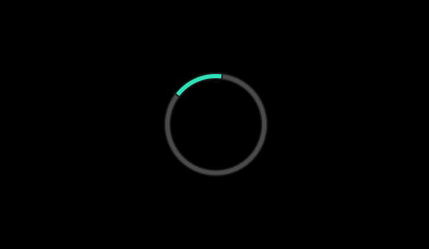
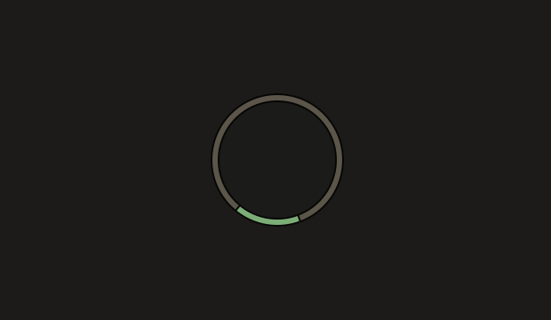

# Acid for swaylock

Two flavours: **Acetic** (`#000000`), vibrant, and **Citric** (`#1c1b19`), muted.

Part of [Acid](https://github.com/acid-theme/acid), a very dark colourscheme in two
flavours. The main README lists the other ports.

## Preview

| Acetic | Citric |
| --- | --- |
|  |  |

## Install

swaylock has no include directive, so this is a colours-only config to compose
with. Keep local options in a separate file and concatenate the two:

```sh
curl -fsSLo /tmp/acid-acetic.conf \
  https://raw.githubusercontent.com/acid-theme/swaylock/main/acid-acetic.conf
cat ~/.config/swaylock/base.conf /tmp/acid-acetic.conf > ~/.config/swaylock/config
```

Or add local options to a copy and point swaylock at it with `swaylock -C`. Keep
the two files disjoint: an unrecognised key makes swaylock exit rather than
lock.

All 29 of swaylock's colour options are set, so nothing falls back to its
light-grey default.

## Files

- `acid-acetic.conf`
- `acid-citric.conf`

## Generated

Acid 0.1.0, rendered by acidify from
[`ports/swaylock/acid.conf.tera`](https://github.com/acid-theme/acid/blob/main/ports/swaylock/acid.conf.tera).
Edits to these files are overwritten on the next release. Report issues on
[acid-theme/acid](https://github.com/acid-theme/acid/issues).

## Licence

MIT.
