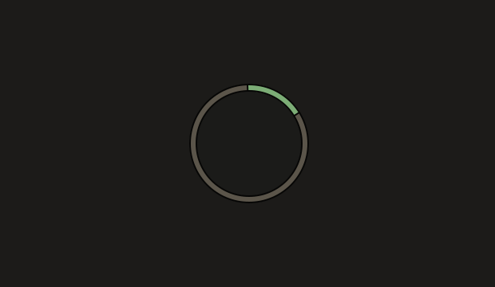
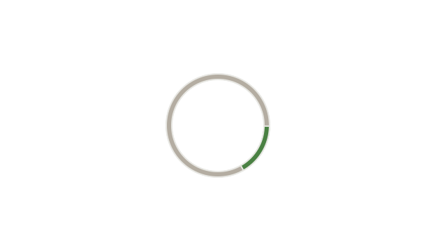

# Acid for swaylock

Generated from [acid-theme/acid](https://github.com/acid-theme/acid) — open issues
and pull requests there.

<details>
<summary>Screenshots</summary>

| Acetic | Citric | Lactic |
| --- | --- | --- |
|  |  |  |

</details>

## Install

swaylock has no include directive, so this is a colours-only config to compose
with. Keep local options in a separate file and concatenate the two:

```sh
curl -fsSLo /tmp/acid-acetic.conf \
  https://raw.githubusercontent.com/acid-theme/swaylock/main/acid-acetic.conf
cat ~/.config/swaylock/base.conf /tmp/acid-acetic.conf > ~/.config/swaylock/config
```

Or add local options to a copy and point swaylock at it with `swaylock -C`. Keep
the two files disjoint: an unrecognised key makes swaylock exit rather than
lock.

## Credits

[@ssiyad](https://github.com/ssiyad)
